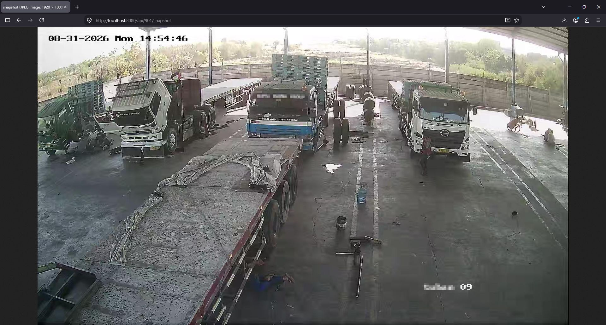

# Spring Boot RTSP Camera Capture

This project is a Spring Boot application that captures still images from an RTSP-based CCTV or DVR camera and exposes them through a REST API as JPEG snapshots.

It is useful for monitoring systems, surveillance integrations, and quick image retrieval from IP cameras without needing a separate video streaming client.

## Screenshot



## Features

- Connects to RTSP camera streams using JavaCV / FFmpeg
- Builds a snapshot URL from the DVR IP address and camera channel ID
- Captures a valid JPEG frame from the camera stream
- Exposes the snapshot through a simple REST endpoint
- Reads camera credentials from environment variables for secure configuration

## Tech Stack

- Java 25
- Spring Boot 4.1.1
- Maven
- JavaCV / FFmpeg
- Spring Web MVC

## Prerequisites

Before running the project, make sure you have:

- Java 25 or compatible JDK installed
- Maven installed
- Access to an RTSP-enabled DVR or IP camera
- A valid camera channel ID

## Configuration

The application reads DVR credentials from environment variables:

- `DVR_USERNAME`
- `DVR_PASSWORD`
- `DVR_IPADDRESS`

These are mapped in `src/main/resources/application.properties`:

```properties
spring.application.name=spring-boot-rtsp-camera-capture

dvr.username=${DVR_USERNAME}
dvr.password=${DVR_PASSWORD}
dvr.ipaddress=${DVR_IPADDRESS}
```

### Example environment setup

On Linux/macOS:

```bash
export DVR_USERNAME=admin
export DVR_PASSWORD=your_password
export DVR_IPADDRESS=192.168.1.100
```

On Windows PowerShell:

```powershell
$env:DVR_USERNAME="admin"
$env:DVR_PASSWORD="your_password"
$env:DVR_IPADDRESS="192.168.1.100"
```

## Running the Application

Use Maven to run the project:

```bash
./mvnw spring-boot:run
```

Or on Windows:

```powershell
mvnw.cmd spring-boot:run
```

The application will start on the default Spring Boot port:

```text
http://localhost:8080
```

## API Endpoint

### Get Snapshot

```http
GET /api/{cameraId}/snapshot
```

This endpoint returns a JPEG image captured from the configured RTSP stream.

### Example

```bash
curl -o snapshot.jpg http://localhost:8080/api/101/snapshot
```

This will download the snapshot for camera channel `101` as a JPEG file.

### Example response

The response contains the image data with `Content-Type: image/jpeg`.

## How It Works

The service constructs an RTSP URL in the following form:

```text
rtsp://username:password@ip_address:554/Streaming/channels/{cameraId}
```

Then it uses FFmpeg to grab a valid video frame and converts it to a JPEG image before returning it to the client.

## Notes

- The project expects a camera or DVR that supports RTSP streaming.
- Camera IDs are channel-based and depend on the DVR/NVR configuration.
- The service retries several frames before failing, which helps when the first frame is not yet ready.

## License

This project is intended for local development and internal surveillance use. Please ensure you comply with your local laws and privacy regulations when deploying camera monitoring systems.
